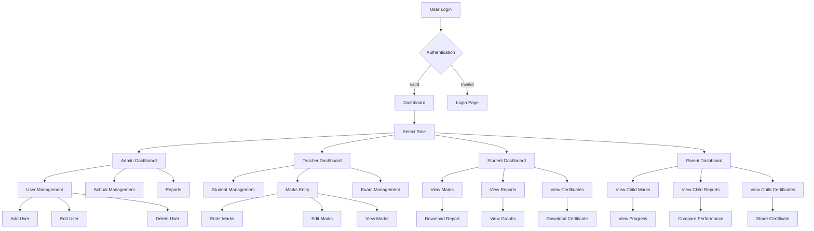

# SRMS Workflow Diagram

```mermaid
graph TB
    A[User Login] --> B{Authentication}
    B -->|Valid| C[Dashboard]
    B -->|Invalid| D[Login Page]
    
    C --> E[Select Role]
    E --> F1[Admin Dashboard]
    E --> F2[Teacher Dashboard]
    E --> F3[Student Dashboard]
    E --> F4[Parent Dashboard]
    
    F1 --> G1[User Management]
    F1 --> G2[School Management]
    F1 --> G3[Reports]
    
    F2 --> H1[Student Management]
    F2 --> H2[Marks Entry]
    F2 --> H3[Exam Management]
    
    F3 --> I1[View Marks]
    F3 --> I2[View Reports]
    F3 --> I3[View Certificates]
    
    F4 --> J1[View Child Marks]
    F4 --> J2[View Child Reports]
    F4 --> J3[View Child Certificates]
    
    G1 --> K1[Add User]
    G1 --> K2[Edit User]
    G1 --> K3[Delete User]
    
    H2 --> L1[Enter Marks]
    H2 --> L2[Edit Marks]
    H2 --> L3[View Marks]
    
    I1 --> M1[Download Report]
    I2 --> M2[View Graphs]
    I3 --> M3[Download Certificate]
    
    J1 --> N1[View Progress]
    J2 --> N2[Compare Performance]
    J3 --> N3[Share Certificate]
```